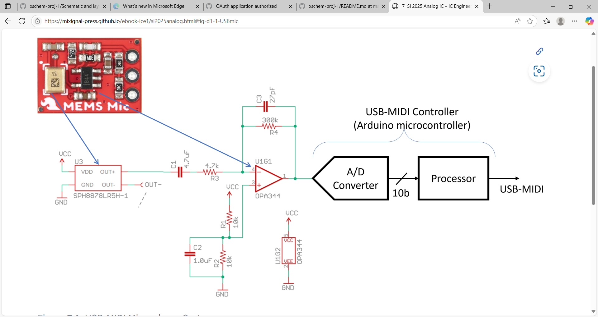
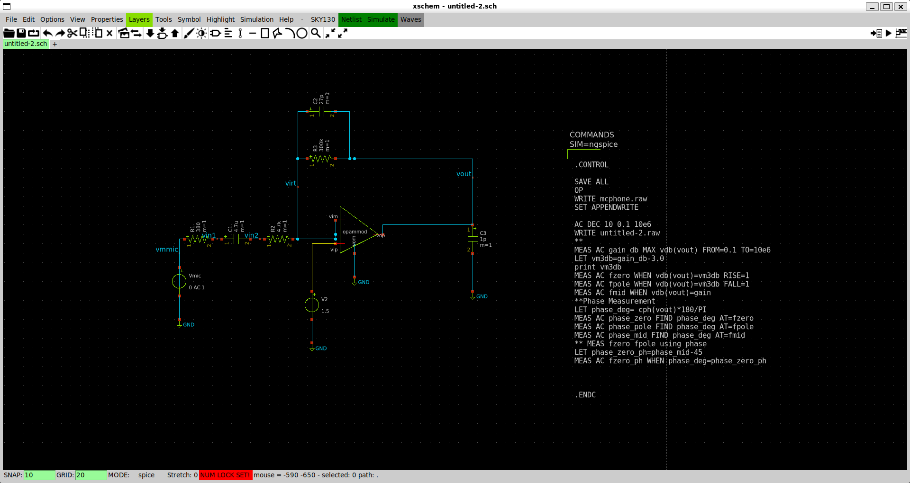
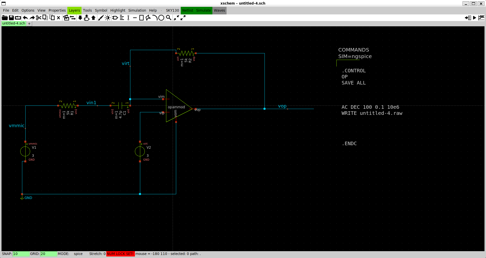
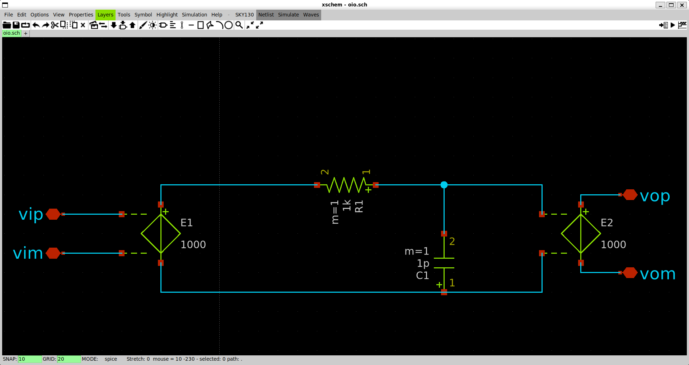
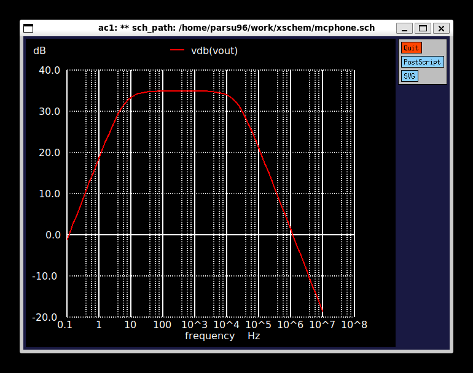

# 🎤 MEMS Microphone Interface IC Design

This repository contains the design, simulation, and analysis of a MEMS microphone interface IC. The project includes:

- Modelled the MEMS microphone as a Thevenin equivalent source
- Designed an amplifier using an op-amp
- Created a high-pass filter
- Added a buffer stage
- Running simulations to verify the design

## 🎙️ Thevenin Equivalent Model Calculations

**SPL to Pressure Conversion:**

$$
\text{Pressure (Pa)} = 10^{\frac{60 - 94}{20}} = 19.95 \times 10^{-3} \, \text{Pa}
$$

**Output Voltage (Peak):**

$$
V_{\text{out (peak)}} = 2 \times 19.95 \times 10^{-3} \times 10^{\frac{-44}{20}} = \mathbf{0.178 \, \text{mV}_{\text{pk}}}
$$
### Schematic:

## 🎛️ Op-Amp Amplifier Stage

Using the SparkFun breakout board design:

- Rin = **5kΩ**
- Rfb = **300kΩ**
- Gain = **60**

**Amplified Output Voltage:**

$$
V_{\text{out}} = 60 \times 0.178 \, \text{mV} = \mathbf{10.68 \, \text{mV}_{\text{pk}}}
$$
### Schematic:

## 🎚️ High-Pass Filter Design

To eliminate low-frequency noise and DC:

- R = **5kΩ**
- C = **4.7 µF**

**High-Pass Filter Cutoff Frequency:**

$$
f_{\text{cutoff}} = \frac{1}{2\pi RC} = \frac{1}{2\pi \cdot 5k \cdot 4.7\mu} \approx \mathbf{6.77 \, \text{Hz}}
$$

### Schematic:

## 🔁 Buffer Op-Amp Stage

Used to isolate load and maintain signal integrity. The buffer has a unity gain and is placed after the filter stage.

### Schematic:

## 📈 Simulation Results

Simulations are done in **Ngspice** using `.ac` and `.tran` analysis to verify:

- Gain Amplification
- Behaviour of the filter (cutoff around 6.77 Hz)
-  Flow of Signal across buffer

### Example Output:

### Summary
- An Analog Front End (AFE) MEMS microphone is a type of microphone that uses Micro-Electro-Mechanical Systems (MEMS) technology to convert sound into electrical signals.
- This setup ensures low noise, high fidelity, and efficient signal conditioning for further audio processing.
 - All stages verified through simulation
- The AFE includes essential analog circuitry—such as preamplifiers, filters, and impedance matching—that processes the raw output from the MEMS sensor before it is sent to an external ADC or signal processor.

